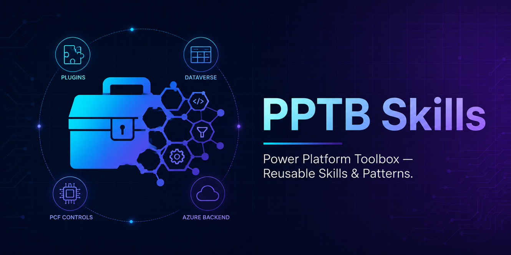

# PPTB skills for PPTB ToolBox and PPTB Tools

A curated library of reusable development skills, patterns, and best practices for building plugins and tools within the Power Platform Toolbox (PPTB) ecosystem — covering plugin architecture, Dataverse integration, PCF controls, rule-engine design, and Azure-hosted backends.

## What are Skills?

Skills are markdown files that give AI agents specialized knowledge and workflows for specific tasks. When you add these to your project, your agent can recognize when you're working on a marketing task and apply the right frameworks and best practices.

## How Skills Work Together

PPTB has two distinct audiences, and every skill belongs to one of them: **tool-development** skills help build an individual tool that runs inside the ToolBox host and talks to Dataverse/Power Platform through injected APIs; **toolbox-development** skills help build the ToolBox host application itself — the Electron shell and its main/renderer processes. The two groups are independent of each other, aimed at different codebases and different contributors.

```mermaid
graph TD
    ToolDev(["tool-development<br/>build a tool that runs inside ToolBox"])
    BoxDev(["toolbox-development<br/>build the ToolBox host app itself"])

    ToolDev --> Scaffold[Scaffold]
    ToolDev --> ApiInt["API Integration"]
    ToolDev --> Config[Configuration]
    ToolDev --> Harden[Hardening]
    ToolDev --> Ext[Extensibility]
    ToolDev --> Release1[Release]

    Scaffold --> s1["create-pptb-tool"]
    Scaffold --> s0["update-pptb-tool"]
    ApiInt --> s2["add-toolbox-api"]
    ApiInt --> s3["add-dataverse-api"]
    ApiInt --> s4["add-powerplatform-api"]
    ApiInt --> s11["add-file-system-api"]
    ApiInt --> s12["add-events-api"]
    ApiInt --> s13["add-settings-api"]
    Config --> s5["configure-csp"]
    Harden --> s6["add-error-handling"]
    Ext --> s7["add-inter-tool-invocation"]
    Ext --> s8["add-agent-integration"]
    Release1 --> s9["validate-pptb-tool"]
    Release1 --> s10["publish-pptb-tool"]

    BoxDev --> Env[Environment]
    BoxDev --> HostCap["Host Capability"]
    BoxDev --> Release2[Release]

    Env --> t1["setup-toolbox-dev-env"]
    HostCap --> t2["add-host-manager"]
    Release2 --> t3["package-toolbox"]

    classDef root fill:#4f46e5,color:#fff,stroke:#333,stroke-width:1px;
    class ToolDev,BoxDev root;
```

A new tool build starts with `create-pptb-tool`; an existing tool goes through `update-pptb-tool` first instead. From there it layers in whichever API skills the tool's functionality needs, adds `configure-csp` if any of those reach an external domain, wraps the result with `add-error-handling`, adds `add-inter-tool-invocation`/`add-agent-integration` for cross-tool or AI-assistant behavior, then closes out with `validate-pptb-tool` and `publish-pptb-tool`. A toolbox contributor runs `setup-toolbox-dev-env` once, reaches for `add-host-manager` whenever a change needs new main-process capability, and finishes with `package-toolbox` before opening a PR.

Skills cross-reference each other within a group — `add-toolbox-api` ↔ `add-dataverse-api` ↔ `add-powerplatform-api` ↔ `add-error-handling` ↔ `add-inter-tool-invocation`. See each skill's own `SKILL.md` for its "Next steps"/"Related" links.

## Available Skills

<!-- SKILLS:START -->
| Skill | Description |
| ----- | ----------- |
| [tool-development](.github/plugins/pptb/skills/tool-development/) | Entry point for building a PPTB tool — a web app that runs inside the Power Platform ToolBox host and talks to Dataverse/Power Platform through injected APIs. Routes to the specific skill a request needs. |
| [create-pptb-tool](.github/plugins/pptb/skills/create-pptb-tool/) | Scaffolds a new Power Platform ToolBox (PPTB) tool — runs the `yo pptb` generator (or a manual fallback), writes a compliant `package.json` manifest, installs `@pptb/types`, and wires a minimal... |
| [update-pptb-tool](.github/plugins/pptb/skills/update-pptb-tool/) | Entry point for modifying an existing PPTB tool — confirms the project, then routes the change (new capability, version bump, dependency upgrade, manifest edit) to the skill that handles it. |
| [add-toolbox-api](.github/plugins/pptb/skills/add-toolbox-api/) | Wires up `window.toolboxAPI` calls — connections, utils (notifications, clipboard, theme, parallel execution, browser open), terminal sessions, inter-tool invocation, and tool context. |
| [add-dataverse-api](.github/plugins/pptb/skills/add-dataverse-api/) | Wires up `window.dataverseAPI` calls — CRUD, relationship associations, FetchXML/OData queries, entity/attribute/relationship/option-set metadata and schema writes, actions, and solution deployment. |
| [add-powerplatform-api](.github/plugins/pptb/skills/add-powerplatform-api/) | Wires up `window.powerplatformAPI` namespace calls (environment management, governance, licensing, analytics, etc.) and the Entra app registration prerequisites they depend on. |
| [add-error-handling](.github/plugins/pptb/skills/add-error-handling/) | Wraps a tool's `toolboxAPI`/`dataverseAPI`/`powerplatformAPI`/file-system calls in `try`/`catch`, with contextual logging, user-facing notifications, and retry logic for transient failures. |
| [add-file-system-api](.github/plugins/pptb/skills/add-file-system-api/) | Wires up `toolboxAPI.fileSystem` calls — reading/writing text and binary files, checking existence, listing directories, and native save/select dialogs. |
| [add-events-api](.github/plugins/pptb/skills/add-events-api/) | Wires up `toolboxAPI.events.on()` so a tool reacts to platform events — connection changes, settings updates, notifications, terminal activity, tool lifecycle — instead of polling. |
| [add-settings-api](.github/plugins/pptb/skills/add-settings-api/) | Wires up `toolboxAPI.settings` calls (`get`/`set`/`getAll`/`setAll`) so a tool persists user preferences across sessions. |
| [configure-csp](.github/plugins/pptb/skills/configure-csp/) | Adds and scopes `cspExceptions` entries in the manifest for external domains a tool needs to reach — CDN scripts, external APIs, webfonts, embedded frames. |
| [add-inter-tool-invocation](.github/plugins/pptb/skills/add-inter-tool-invocation/) | Wires up a tool as a caller, a callee, or both, so it can launch another installed tool and exchange data with it via `pptb.config.json` and `toolboxAPI.invocation`. |
| [add-agent-integration](.github/plugins/pptb/skills/add-agent-integration/) | Exposes a tool to AI assistants through the ToolBox's built-in MCP server — the `agents` object in `pptb.config.json`, execution modes, and a headless entry point. |
| [validate-pptb-tool](.github/plugins/pptb/skills/validate-pptb-tool/) | Runs and interprets `pptb-validate` against a tool's `package.json` manifest before publishing. |
| [publish-pptb-tool](.github/plugins/pptb/skills/publish-pptb-tool/) | Finalizes, builds, and publishes a tool to npm, then submits it to the ToolBox registry. |
| [toolbox-development](.github/plugins/pptb/skills/toolbox-development/) | Entry point for contributing to the Power Platform ToolBox host application itself — the Electron shell that loads and runs tools. Routes to the specific skill a request needs. |
| [setup-toolbox-dev-env](.github/plugins/pptb/skills/setup-toolbox-dev-env/) | Forks, clones, and bootstraps a local development environment for the Power Platform ToolBox host application. |
| [add-host-manager](.github/plugins/pptb/skills/add-host-manager/) | Scaffolds a new main-process manager for the ToolBox host, following the existing settings/connections/tool-lifecycle/auth pattern and wired through `toolboxAPI`/`toolboxAPIBridge.js`. |
| [package-toolbox](.github/plugins/pptb/skills/package-toolbox/) | Runs lint, type-check, and build steps for the ToolBox host, then produces a platform-specific packaged build from its three Vite bundles. |
<!-- SKILLS:END -->

All 19 skills in the catalog have drafted content — see [VERSIONS.md](VERSIONS.md) for per-skill version history and [docs/pptb-skills](docs/pptb-skills/) for the original design specs.
